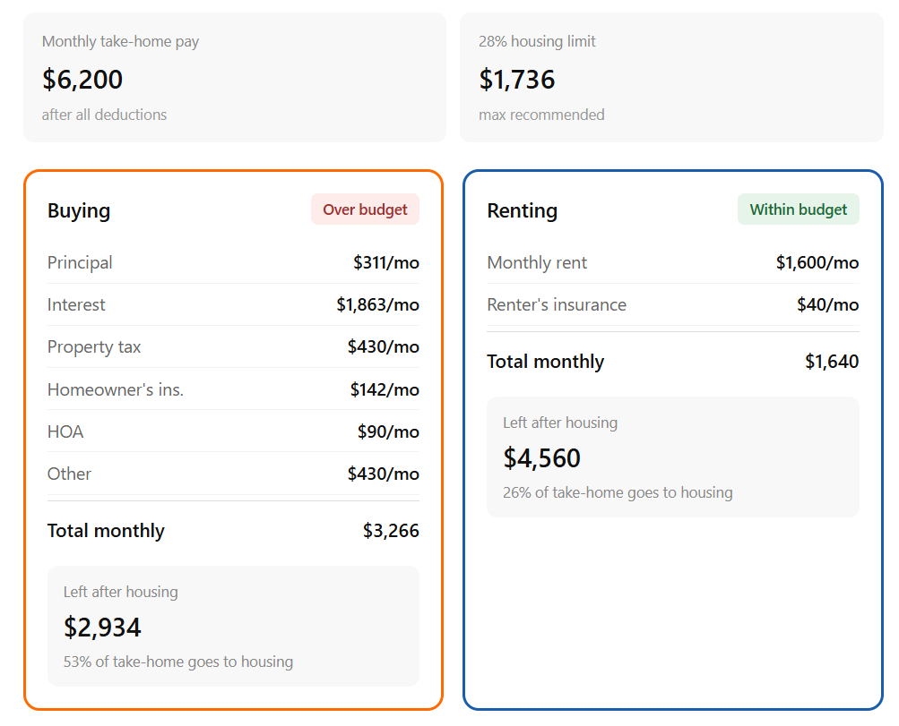

# Rent vs. Buy: True Cost Affordability Calculator

An interactive web tool that compares the full cost of renting versus buying a home, including PMI, property tax, HOA, insurance, and the principal vs. interest breakdown.

**[→ Try the live calculator](https://brittanyships.github.io/rent-vs-buy-calculator/)**

---

## The Problem

This calculator makes it easy to compare the true cost of renting versus buying. It breaks down key expenses (PMI, property tax, HOA, insurance, principal vs. interest), shows both options side by side, and presents the results in plain language — no financial background required.

## What I Built

A guided, three-step tool that puts renting and buying side by side and anchors both against what the user actually takes home each month.

1. **Income** — Monthly take-home pay after all deductions.
2. **Costs** — Full breakdown for renting and buying, including PMI, property tax, HOA, insurance, and the principal/interest split.
3. **Comparison** — What each costs, what's left over, and whether you're within the 28% guideline.

Designed as a decision-support tool, not a recommendation engine. It provides information, not a prescription. The output is fact-based, and the decision remains with the user.

## Key Features

- Parallel scenario modeling with full cost decomposition for renting and buying
- Mortgage payment decomposition showing principal and interest allocation in month one
- 28/36 debt-to-income ratio applied as a decision threshold with contextual explanation
- Inline definitional support for domain-specific financial terminology
- Progressive disclosure UX designed for quick completion by non-expert users

## What I Learned

The challenge was translating financial domain logic into a non-expert interface. The hardest decisions were product-level, not computational: using take-home pay over gross (withholding variability), designing for information rather than recommendation, and optimizing the output for clarity through multiple iterations.

This was built with AI-assisted development, which involved scoping constraints precisely, validating generated logic against test cases, and maintaining decision authority over the tooling rather than accepting first-pass output.

## Built With

- Vanilla JavaScript (no frameworks or dependencies)
- CSS custom properties for theming
- AI-assisted development (Claude)
- Deployed via GitHub Pages

## About

Built by Brittany Campbell, Product Specialist. I build tools at the intersection of product strategy, quantitative analysis, and applied AI.

## Connect

[LinkedIn](http://www.linkedin.com/in/bcampbellmj)

---

*Disclaimer: This tool provides estimates for educational purposes only and does not constitute financial advice. Consult a qualified financial professional for personalized guidance.*
